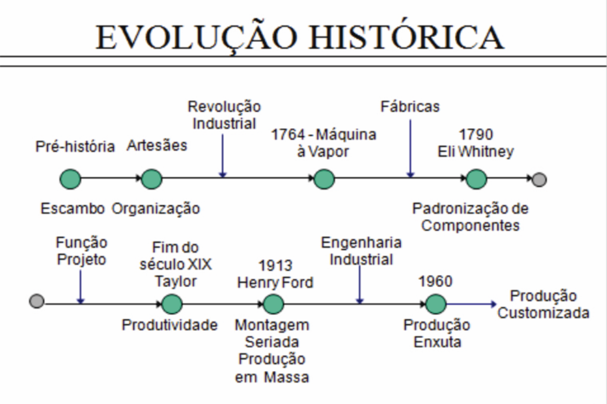

```{r child = "setup.Rmd"}
```

```{r xaringan-tile-view, echo=FALSE}
xaringanExtra::use_tile_view()
```

```{r xaringan-editable, echo=FALSE}
xaringanExtra::use_editable(expires = 1)
```

```{r xaringanExtra-clipboard, echo=FALSE}
htmltools::tagList(
  xaringanExtra::use_clipboard(
    button_text = "<i class=\"fa fa-clipboard\"></i>",
    success_text = "<i class=\"fa fa-check\" style=\"color: #90BE6D\"></i>",
    error_text = "<i class=\"fa fa-times-circle\" style=\"color: #F94144\"></i>"
  ),
  rmarkdown::html_dependency_font_awesome()
)
```

```{r xaringan-fit-screen, echo=FALSE}
xaringanExtra::use_fit_screen()
```

```{r xaringan-extra-styles, echo=FALSE}
xaringanExtra::use_extra_styles(
  hover_code_line = TRUE,         #<<
  mute_unhighlighted_code = TRUE  #<<
)
```

```{r xaringan-scribble, echo=FALSE}
xaringanExtra::use_scribble()
```


```{r message=FALSE, warning=FALSE, include=FALSE}
library(ggplot2)
library(dplyr)
library(tidyr)
library(scales)
library(kableExtra)
library(knitr)
```


```{r message=FALSE, warning=FALSE, include=FALSE}
formatar_tabela_basica <- function(dataframe, titulo, notas = NULL) {
  # Verificar se o dataframe não está vazio
  if (nrow(dataframe) == 0) {
    stop("O dataframe está vazio")
  }
  
  # Criar a tabela básica
  tabela <- dataframe %>%
    kable(format = "html", escape = FALSE, align = "c", caption = titulo) %>%
    kable_styling(
      bootstrap_options = c("striped", "hover", "condensed"),
      full_width = TRUE,
      position = "center"
    )
  
  # Adicionar notas se fornecidas
  if (!is.null(notas)) {
    tabela <- tabela %>%
      footnote(
        general = notas,
        general_title = "Nota:",
        footnote_as_chunk = TRUE
      )
  }
  
  # Adicionar scroll box
  tabela %>%
    scroll_box(width = "100%", height = "300px")
}

formatar_tabela_numerica <- function(dataframe, titulo, casas_decimais = 1, notas = NULL) {
  # Formatar colunas numéricas
  for (col in names(dataframe)) {
    if (is.numeric(dataframe[[col]])) {
      dataframe[[col]] <- round(dataframe[[col]], casas_decimais)
    }
  }
  
  dataframe %>%
    kable(format = "html", escape = FALSE, align = "c", caption = titulo) %>%
    kable_styling(
      bootstrap_options = c("striped", "hover", "condensed"),
      full_width = TRUE,
      position = "center"
    ) %>%
    kable_paper() %>%
    scroll_box(width = "100%", height = "300px")
    #row_spec(0, bold = TRUE, background = "#f8f9fa") %>%
    #{if(!is.null(notas)) add_footnote(., notas, notation = "alphabet") else .}
}


formatar_tabela_com_destaque <- function(dataframe, titulo, linha_destaque = NULL, notas = NULL) {
  tabela <- dataframe %>%
    kable(format = "html", escape = FALSE, align = "c", caption = titulo) %>%
    kable_styling(
      bootstrap_options = c("striped", "hover", "condensed"),
      full_width = FALSE,
      position = "center"
    ) %>%
    row_spec(0, bold = TRUE, background = "#f8f9fa")
  
  if (!is.null(linha_destaque)) {
    tabela <- tabela %>% row_spec(linha_destaque, bold = TRUE, background = "#e6f3ff")
  }
  
  if (!is.null(notas)) {
    tabela <- tabela %>% add_footnote(notas, notation = "alphabet")
  }
  
  return(tabela)
}

# Funções para cálculo dos métodos
calcular_mms <- function(dados, n = 3) {
  previsoes <- numeric(length(dados))
  for (i in (n+1):length(dados)) {
    previsoes[i] <- mean(dados[(i-n):(i-1)])
  }
  return(previsoes)
}

calcular_mmp <- function(dados, pesos = c(0.5, 0.3, 0.2)) {
  n <- length(pesos)
  previsoes <- numeric(length(dados))
  for (i in (n+1):length(dados)) {
    previsoes[i] <- sum(dados[(i-n):(i-1)] * pesos)
  }
  return(previsoes)
}

calcular_ses <- function(dados, alpha = 0.3) {
  previsoes <- numeric(length(dados))
  previsoes[1] <- dados[1]
  for (i in 2:length(dados)) {
    previsoes[i] <- alpha * dados[i-1] + (1 - alpha) * previsoes[i-1]
  }
  return(previsoes)
}

calcular_mape <- function(real, previsao) {
  indices_validos <- !is.na(previsao) & previsao != 0
  erro_percentual <- abs((real[indices_validos] - previsao[indices_validos]) / real[indices_validos]) * 100
  return(mean(erro_percentual))
}

# Função para salvar tabelas individualmente
salvar_tabela_html <- function(tabela, nome_arquivo) {
  save_kable(tabela, file = nome_arquivo)
}

```


# Evolução histórica

## **Produção Artesanal**   
Forma de produção organizada através dos artesãos que estabeleciam prazos de entrega e prioridades, atendendo especificações preestabelecidas e fixando preços para suas encomendas. Posteriormente a produção aumentou o número de encomendas, passando contratar ajudantes que inicialmente faziam trabalhos de menor responsabilidade e assim que aprendiam o ofício, se tornavam novos artesãos.

---

# Evolução histórica

## **Revolução Industrial**   
A descoberta da máquina a vapor em **1764** por James Watt (decadência da produção artesanal), inicia-se o processo de substituição da força humana pela força da máquina. Os artesãos se agruparam para formar as primeiras fábricas. Essa revolução no modo de fabricação trouxe: 

.pull-left[
- Padronização dos produtos;   
- Padronização dos processos de fabricação;    
- Treinamento e habilitação da MDO; 
- Criação e desenvolvimento dos quadros gerenciais e de supervisão; ]  


.pull-right[
- Desenvolvimento de técnicas de planejamento e controle da produção;   
- Desenvolvimento de técnicas de planejamento e controle financeiro;   
- Desenvolvimento de técnicas de vendas.
]

---

# Evolução histórica

## **Taylorismo** (Administração Científica)

Surgiu no **fim do século XIX** nos Estados Unidos através de Taylor a sistematização do conceito de produtividade, isto é, a procura incessante por melhores métodos de trabalho e processos de produção, com o objetivo de se obter melhoria da produtividade com o menor custo possível.

---

# Evolução histórica


## **Linha de Montagem**   
Henry Ford **(1910)** cria a produção em série, revolucionando os métodos e processos produtivos. Surge o conceito de produção em massa, caracterizada por grandes volumes de produtos padronizados. A busca da melhoria da produtividade por meio de novas técnicas originou o termo engenharia industrial. Novos conceitos foram introduzidos:

.pull-left[
- Linha de montagem; 
- Posto de trabalho; 
- Estoques intermediários; 
- Monotonia do trabalho; 
- Arranjo físico;]

.pull-right[
- Balanceamento de linha; 
- Produtos em processo; 
- Motivação; 
- Sindicatos; 
- Manutenção preventiva.
]

---

# Evolução histórica

## **Modelo Pós-fordista**

**Modelo Toyota (Produção Enxuta)**: A partir de **meados da década de 60**, surgiram novas técnicas produtivas, que vieram a caracterizar a denominada produção enxuta que introduziu, os conceitos:

.pull-left[
- Just-in-time;
- Engenharia simultânea; 
- Tecnologia de grupo; 
- Consórcio modular; 
]

.pull-right[
- Células de produção; 
- Desdobramento da função qualidade; 
- Comakership, Sistemas flexíveis de manufatura; 
- Manufatura integrada por computador; 
- Benchmarking.]

---

# Evolução histórica
```{r echo=FALSE, message=FALSE, warning=FALSE, out.width="70%"}

```

---
class: inverse

# Evolução histórica

.center[
.huge[
E HOJE???????
]]

---

# Decisões centrais na Administração da Produção 

.large[
- O **que** produzir e comprar?
- **Quanto** produzir e comprar?
- **Quando** produzir e comprar?
- Com que **recurso** produzir?
- **Como levar** produtos ou serviços para o consumidor?
]


---

# Fundamentos da previsão de demanda

*   **Definição:** Previsão de demanda é o processo de estimar a quantidade futura de produtos ou serviços que os clientes irão adquirir em um período específico, sob determinadas condições.
*   **Papel na Administração da Produção:** É o ponto de partida para todo o planejamento e controle. Uma previsão precisa é crítica para:
    *   **Planejamento da Capacidade:** Definir o tamanho da fábrica, compra de máquinas.
    *   **Gestão de Estoques:** Evitar excessos (custos) ou falta (perda de vendas).
    *   **Planejamento Mestre da Produção (PMP):** Definir o que e quando produzir.
    *   **Compras:** Planejar a aquisição de matéria-prima (diretamente ligada à Eng. de Materiais).
    *   **Orçamentação:** Estimar custos e receitas futuras.

---

# Fundamentos da previsão de demanda

*   **Características das Previsões (Slack):**
    *   São **sempre imprecisas**. O objetivo é minimizar o erro, não eliminá-lo.
    *   São **mais precisas para agregados** (ex.: previsão para uma família de produtos) do que para itens individuais.
    *   São **menos precisas para períodos mais longos** (horizonte de longo prazo).

---

# Fundamentos da previsão de demanda

### a) Produção sob Encomenda (Make-to-Order - MTO)

*   **Como funciona:** O produto só é iniciado após a confirmação do pedido do cliente. Exemplos: navios, máquinas industriais, prédios, ternos sob medida.
*   **Papel da Previsão de Demanda:** A previsão aqui é **menos sobre "o que" e "quanto" produzir**, e mais sobre **capacidade e lead times**.
   *   **Previsão de Demanda Agregada:** É usada para prever a carga de trabalho futura na fábrica (ex.: quantas horas de trabalho serão necessárias no próximo trimestre?).
   *   **Finalidade:** Planejar a capacidade (contratar/demitir funcionários, comprar máquinas), adquirir materiais estratégicos de longo lead time e definir prazos de entrega realistas para os clientes.

---

# Fundamentos da previsão de demanda

### b) Produção para Estoque (Make-to-Stock - MTS)
*   **Como funciona:** Os produtos são fabricados antecipadamente e mantidos em estoque, prontos para a demanda. Exemplos: eletrodomésticos, bebidas, produtos de consumo.
*   **Papel da Previsão de Demanda:** **CRITICO**. É o coração do sistema.
    *   **Previsão de Demanda Detalhada:** É necessária uma previsão precisa por item (SKU) para definir os níveis de estoque-alvo.
    *   **Finalidade:** Calcular o **Plano Mestre de Produção (MPS)**, que define o que, quanto e quando produzir para repor os estoques, evitando tanto a falta (ruptura) quanto o excesso (estoque obsoleto).

---

# Fundamentos da previsão de demanda

### c) Montagem sob Encomenda (Assemble-to-Order - ATO)
*   **Como funciona:** Componentes e subconjuntos são produzidos ou comprados antecipadamente, mas a montagem final só ocorre após o pedido. Exemplos: computadores Dell, carros com muitas opções.
*   **Papel da Previsão de Demanda:**
    *   **Previsão ao Nível de Componentes:** A previsão não é para o produto final (ex.: "notebook i7, 16GB, 512GB"), mas para os **componentes comuns** (ex.: quantas telas de 15", quantos processadores i7, quantos GB de RAM serão necessários?).
    *   **Finalidade:** Elaborar o **Plano Mestre de Produção (MPS)** para os componentes e gerenciar seus estoques. A montagem final é acionada pelo pedido real.

---

# Fundamentos da previsão de demanda

### d) Engenharia sob Encomenda (Engineer-to-Order - ETO)
*   **Como funciona:** O projeto do produto é customizado para cada pedido. A produção só começa após a engenharia. Exemplos: usinas de energia, linhas de produção automatizadas.
*   **Papel da Previsão de Demanda:** Semelhante ao MTO, mas ainda mais estratégica e de longo prazo.
    *   **Previsão de Mercado:** Foca em tendências de mercado, projetos de lei, investimentos de grandes clientes.
    *   **Finalidade:** Planejamento estratégico de capacidade, investimentos em P&D e preparação da cadeia de suprimentos para materiais críticos.

---

# Fundamentos da previsão de demanda

### e) Layout por Posição Fixa
*   **Como funciona:** O produto principal fica parado e os recursos (mão de obra, equipamentos) se movem até ele. Exemplos: construção civil, estaleiros.
*   **Relação com a Previsão:** A previsão de demanda é usada para **planejar a alocação de recursos críticos** (equipes especializadas, guindastes) ao longo do tempo para múltiplos projetos.

---

# Fundamentos da previsão de demanda

### f) Layout por Processo (Funcional)
*   **Como funciona:** Máquinas ou atividades similares são agrupadas em departamentos (ex.: departamento de solda, departamento de pintura). O produto flui entre esses departamentos. Típico de produção sob encomenda (MTO) ou de baixo volume/alta variedade.
*   **Relação com a Previsão:** A previsão de demanda agregada é vital para **dimensionar a capacidade de cada departamento**. Se a previsão indica aumento de vendas de produtos que exigem mais usinagem, o departamento de usinagem precisa ser expandido.

---

# Fundamentos da previsão de demanda

### g) Layout por Produto (Linha de Montagem)
*   **Como funciona:** Máquinas e equipamentos são dispostos na sequência exata das operações necessárias para fabricar um produto. Típico de produção em massa para estoque (MTS).
*   **Relação com a Previsão:** **DIRETA E CRUCIAL**. O **ritmo da linha (takt time)** é calculado com base na previsão de demanda.
    *   **Exemplo:** Se a previsão é de vender 480 unidades por dia em um turno de 8 horas (480 minutos), o *takt time* é de 1 minuto. A linha deve produzir uma unidade a cada minuto para atender à demanda. Qualquer alteração significativa na previsão pode exigir um rebalanceamento da linha.

---

# Fundamentos da previsão de demanda

### h) Layout Celular (Manufacturing Cells)
*   **Como funciona:** Células são criadas para produzir famílias de produtos com processos similares. Combina vantagens do layout por processo e por produto.
*   **Relação com a Previsão:** A previsão de demanda é usada para:
    1.  **Definir as famílias de produtos** que formarão cada célula.
    2.  **Dimensionar a capacidade de cada célula** com base na demanda prevista para sua família de produtos.

---

# Fundamentos da previsão de demanda

.small[

| Modelo/Layout | Principal Uso da Previsão de Demanda | Horizonte Típico da Previsão |
| :--- | :--- | :--- |
| **Produção para Estoque (MTS)** | Definir o plano mestre de produção e níveis de estoque | Curto e médio prazo (semanas, meses) |
| **Montagem sob Encomenda (ATO)** | Planejar estoques de componentes comuns | Médio prazo (meses) |
| **Produção sob Encomenda (MTO)** | Planejamento de capacidade e lead times | Médio e longo prazo (trimestres, anos) |
| **Engenharia sob Encomenda (ETO)** | Planejamento estratégico e de capacidade | Longuíssimo prazo (anos) |
| **Layout por Produto (Linha)** | Definir o ritmo de produção (*takt time*) | Curto e médio prazo |
| **Layout por Processo** | Dimensionar a capacidade de cada departamento | Médio prazo |
]

**Conclusão:** A previsão de demanda não é um elemento opcional; é um **pré-requisito** para um planejamento de produção eficaz, independentemente do modelo ou layout escolhido. A precisão da previsão impacta diretamente a eficiência, os custos e o nível de serviço ao cliente da empresa.


---

# Fundamentos da previsão de demanda

### **Horizonte de Tempo:**

*   **Longo Prazo (> 2 anos):** Para planejamento estratégico (nova fábrica, novos produtos). Técnicas qualitativas são comuns.
*   **Médio Prazo (3 meses a 2 anos):** Para Planejamento Agregado da Produção (PAP). Técnicas quantitativas (séries temporais) são predominantes.
*   **Curto Prazo (diário a 3 meses):** Para programação detalhada da produção e controle de estoques. Técnicas quantitativas de alta frequência.

---

# Fundamentos da previsão de demanda

### **Padrões de Demanda (Rodrigues):**

**Tendência:** Crescimento ou declínio sustentado ao longo do tempo.   
**Sazonalidade:** Variações regulares e previsíveis que se repetem em períodos fixos (ex.: verão, Natal).   
**Ciclicidade:** Variações relacionadas a ciclos econômicos (mais longos e irregulares).   
**Variação Aleatória:** Flutuações imprevisíveis ("ruído").

---

# Fundamentos da previsão de demanda

### **Técnicas de Previsão**

*   **A. Técnicas Qualitativas:** Baseadas em julgamento e opinião. Usadas quando há poucos dados históricos (lançamento de produtos) ou em contextos muito incertos.
    *   **Opinião de Especialistas:** Consulta a vendedores, gerentes, engenheiros.
    *   **Pesquisa de Mercado:** Entrevistas com clientes potenciais.
    *   **Método Delphi:** Rodadas anônimas de questionários com especialistas para chegar a um consenso.


---

# Fundamentos da previsão de demanda

#  **Técnicas de Previsão**

*   **B. Técnicas Quantitativas:** Baseadas em dados históricos e modelos matemáticos.
    *   **Séries Temporais:** Assume que o padrão passado se repetirá no futuro.
        *   **Média Móvel Simples:** Média das demandas dos últimos `n` períodos. Simples, mas ignora tendências e sazonalidade.
        *   **Média Móvel Ponderada:** Atribui pesos diferentes aos períodos (pesos maiores para dados mais recentes).
---

# Fundamentos da previsão de demanda

###  **Técnicas de Previsão**

*   **B. Técnicas Quantitativas:** Baseadas em dados históricos e modelos matemáticos.
    *   **Séries Temporais:** Assume que o padrão passado se repetirá no futuro.
        *   **Suavização Exponencial:** Similar à média móvel ponderada, mas os pesos decaem exponencialmente. Mais eficiente computacionalmente. A fórmula básica é: `Previsão_nova = α * Demanda_real_anterior + (1 - α) * Previsão_anterior`, onde `α` é a constante de suavização (0 < α < 1).
        *   **Decomposição de Série Temporal:** Separa a demanda em seus componentes (tendência, sazonalidade, ciclo e aleatoriedade) para modelagem individual.
    *   **Modelos Causais (Regressão):** Assume uma relação de causa e efeito entre a demanda e uma ou mais variáveis independentes (ex.: preço do produto, índice de desemprego, PIB). Mais complexo, mas potencialmente mais preciso para o longo prazo.

---

# Fundamentos da previsão de demanda

### **Medição de Erros da Previsão**

*   É fundamental medir a acurácia da previsão para validar e melhorar o modelo.
*   **Erro da Previsão:** `Erro = Demanda Real - Previsão`
*   **Medidas Comuns:**
    *   **MAE (Mean Absolute Error - Erro Médio Absoluto):** Média dos valores absolutos dos erros. Fácil de interpretar.
    *   **MSE (Mean Squared Error - Erro Quadrático Médio):** Média dos quadrados dos erros. Penaliza erros grandes.
    *   **MAPE (Mean Absolute Percentage Error - Erro Percentual Absoluto Médio):** Expressa o erro em porcentagem. Muito útil para comparação entre diferentes produtos.

---

# Detalhamento das Técnicas

### **Dados Históricos de Demanda**

.small[
```{r echo=FALSE, message=FALSE, warning=FALSE}
# 1. DADOS HISTÓRICOS DE DEMANDA
demanda_real <- data.frame(
  Mes = 1:12,
  Demanda_Real = c(120, 135, 118, 142, 130, 155, 145, 160, 138, 165, 150, 170)
)

formatar_tabela_numerica(
  demanda_real,
  titulo = "Série Temporal da Demanda Real (Unidades/Mês)",
  casas_decimais = 0,
  notas = "Fonte: Dados simulados para análise didática"
)
```
]

---

# Detalhamento das Técnicas

### **Dados Históricos de Demanda**

```{r echo=FALSE, message=FALSE, warning=FALSE}
grafico_demanda_real <- ggplot(demanda_real, aes(x = Mes, y = Demanda_Real)) +
  geom_line(linewidth = 1.2, color = "#1f77b4") +
  geom_point(size = 3, color = "#1f77b4") +
  labs(
    title = "Demanda Real - Série Temporal Base",
    subtitle = "Padrões: Tendência de crescimento, flutuações sazonais e variações aleatórias",
    x = "Mes",
    y = "Demanda (Unidades)"
  ) +
  theme_minimal() +
  theme(
    plot.title = element_text(face = "bold", size = 14, hjust = 0.5),
    plot.subtitle = element_text(size = 10, hjust = 0.5),
    panel.grid.minor = element_blank()
  ) +
  scale_x_continuous(breaks = 1:12) +
  scale_y_continuous(limits = c(110, 180)) +
  geom_smooth(method = "lm", se = FALSE, linetype = "dashed", color = "red", linewidth = 0.5)

print(grafico_demanda_real)

```
---

# Detalhamento das Técnicas

### **Média Móvel Simples (MMS)**

**Conceito:** A previsão para o próximo período é a média aritmética das demandas reais dos `n` períodos mais recentes.

**Fórmula:**
`Previsão (período t+1) = Σ (Demanda Real dos últimos n períodos) / n`

---

# Detalhamento das Técnicas

### **Média Móvel Simples (MMS)**

**Exemplo Prático:** Vamos calcular usando **n=3** (média móvel de 3 meses).

.small[
```{r echo=FALSE, message=FALSE, warning=FALSE}
# 2. MÉDIA MÓVEL SIMPLES (n=3)
mms_calculos <- data.frame(
  Mes = 1:13,
  Demanda_Real = c(120, 135, 118, 142, 130, 155, 145, 160, 138, 165, 150, 170, NA),
  Calculo_MMS = c(
    "-", "-", "-", 
    "(120+135+118)/3", "(135+118+142)/3", "(118+142+130)/3",
    "(142+130+155)/3", "(130+155+145)/3", "(155+145+160)/3",
    "(145+160+138)/3", "(160+138+165)/3", "(138+165+150)/3",
    "(165+150+170)/3"
  ),
  Previsao_MMS = c(NA, NA, NA, 124.3, 131.7, 130.0, 142.3, 143.3, 153.3, 144.3, 154.3, 151.0, 161.7)
)

dados_mms_grafico <- data.frame(
  Mes = 1:12,
  Demanda_Real = c(120, 135, 118, 142, 130, 155, 145, 160, 138, 165, 150, 170),
  Previsao_MMS = c(NA, NA, NA, 124.3, 131.7, 130.0, 142.3, 143.3, 153.3, 144.3, 154.3, 151.0)
)

formatar_tabela_numerica(
  mms_calculos,
  titulo = "Cálculo da Média Móvel Simples - Fórmula: Previsão(t+1) = Σ(Demanda últimos n períodos) / n",
  casas_decimais = 1,
  notas = c("n = 3 períodos", "Previsão para o mês 13: 161.7 unidades")
) %>%
  row_spec(13, bold = TRUE, background = "#fff2cc")

```
]

---

# Detalhamento das Técnicas

### **Média Móvel Simples (MMS)**

```{r echo=FALSE, message=FALSE, warning=FALSE}
grafico_mms <- ggplot(dados_mms_grafico, aes(x = Mes)) +
  geom_line(aes(y = Demanda_Real, color = "Demanda Real"), linewidth = 1.2) +
  geom_point(aes(y = Demanda_Real, color = "Demanda Real"), size = 2) +
  geom_line(aes(y = Previsao_MMS, color = "Previsão MMS (n=3)"), linewidth = 1.2, na.rm = TRUE) +
  geom_point(aes(y = Previsao_MMS, color = "Previsão MMS (n=3)"), size = 2, na.rm = TRUE) +
  scale_color_manual(
    name = "",
    values = c("Demanda Real" = "#1f77b4", "Previsão MMS (n=3)" = "#ff7f0e")
  ) +
  labs(
    title = "Média Móvel Simples (n=3) vs. Demanda Real",
    subtitle = "A linha de previsão é mais suave que a linha da demanda real. \n A MMS suaviza as flutuações, mas sempre fica atrás da tendência, reagindo lentamente a mudanças",
    x = "Mês",
    y = "Demanda (Unidades)"
  ) +
  theme_minimal() +
  theme(
    plot.title = element_text(face = "bold", size = 12, hjust = 0.5),
    plot.subtitle = element_text(size = 9, hjust = 0.5),
    legend.position = "bottom",
    panel.grid.minor = element_blank()
  ) +
  scale_x_continuous(breaks = 1:12) +
  scale_y_continuous(limits = c(110, 180))

print(grafico_mms)


```


---

# Detalhamento das Técnicas

### **Média Móvel Ponderada (MMP)**

**Conceito:** Atribui pesos diferentes a cada período, dando mais importância aos dados mais recentes.

**Fórmula:**
`Previsão (t+1) = (Peso₁ * Realₜ) + (Peso₂ * Realₜ₋₁) + ... + (Pesoₙ * Realₜ₋ₙ₊₁)`
*Onde a soma dos pesos deve ser igual a 1.*

---

# Detalhamento das Técnicas

### **Média Móvel Ponderada (MMP)**

**Exemplo Prático:** Cálculo da Média Móvel Ponderada - Pesos: 0.5 (mês t-1), 0.3 (mês t-2), 0.2 (mês t-3)

.small[
```{r echo=FALSE, message=FALSE, warning=FALSE}
# 3. MÉDIA MÓVEL PONDERADA (pesos: 0.5, 0.3, 0.2)
mmp_calculos <- data.frame(
  Mes = 1:13,
  Demanda_Real = c(120, 135, 118, 142, 130, 155, 145, 160, 138, 165, 150, 170, NA),
  Calculo_MMP = c(
    "-", "-", "-",
    "(118×0.5)+(135×0.3)+(120×0.2)",
    "(142×0.5)+(118×0.3)+(135×0.2)",
    "(130×0.5)+(142×0.3)+(118×0.2)",
    "(155×0.5)+(130×0.3)+(142×0.2)",
    "(145×0.5)+(155×0.3)+(130×0.2)",
    "(160×0.5)+(145×0.3)+(155×0.2)",
    "(138×0.5)+(160×0.3)+(145×0.2)",
    "(165×0.5)+(138×0.3)+(160×0.2)",
    "(150×0.5)+(165×0.3)+(138×0.2)",
    "(170×0.5)+(150×0.3)+(165×0.2)"
  ),
  Previsao_MMP = c(NA, NA, NA, 126.5, 133.4, 132.4, 146.9, 147.0, 152.5, 146.0, 155.9, 152.1, 163.0)
)

dados_mmp_grafico <- data.frame(
  Mes = 1:12,
  Demanda_Real = c(120, 135, 118, 142, 130, 155, 145, 160, 138, 165, 150, 170),
  Previsao_MMP = c(NA, NA, NA, 126.5, 133.4, 132.4, 146.9, 147.0, 152.5, 146.0, 155.9, 152.1)
)

formatar_tabela_numerica(
  mmp_calculos,
  titulo = "Cálculo da Média Móvel Ponderada - Pesos: 0.5 (mês t-1), 0.3 (mês t-2), 0.2 (mês t-3)",
  casas_decimais = 1,
  notas = c("Soma dos pesos = 1.0", "Previsão para o mês 13: 163.0 unidades")
) %>%
  row_spec(13, bold = TRUE, background = "#fff2cc")

```
]

---

# Detalhamento das Técnicas

### **Média Móvel Ponderada (MMP)**


```{r echo=FALSE, message=FALSE, warning=FALSE}
grafico_mmp <- ggplot(dados_mmp_grafico, aes(x = Mes)) +
  geom_line(aes(y = Demanda_Real, color = "Demanda Real"), linewidth = 1.2) +
  geom_point(aes(y = Demanda_Real, color = "Demanda Real"), size = 2) +
  geom_line(aes(y = Previsao_MMP, color = "Previsão MMP (0.5,0.3,0.2)"), linewidth = 1.2, na.rm = TRUE) +
  geom_point(aes(y = Previsao_MMP, color = "Previsão MMP (0.5,0.3,0.2)"), size = 2, na.rm = TRUE) +
  scale_color_manual(
    name = "",
    values = c("Demanda Real" = "#1f77b4", "Previsão MMP (0.5,0.3,0.2)" = "#2ca02c")
  ) +
  labs(
    title = "Média Móvel Ponderada vs. Demanda Real",
    subtitle = "A MMP reage mais rapidamente aos picos e vales da demanda real (como no mês 6) em comparação com a MMS, \n porque dá mais peso ao período mais recente. \n A previsão para o mês 13 (163.0) é mais alta que a da MMS (161.7), refletindo melhor a tendência de alta recente",
    x = "Mês",
    y = "Demanda (Unidades)"
  ) +
  theme_minimal() +
  theme(
    plot.title = element_text(face = "bold", size = 12, hjust = 0.5),
    plot.subtitle = element_text(size = 9, hjust = 0.5),
    legend.position = "bottom",
    panel.grid.minor = element_blank()
  ) +
  scale_x_continuous(breaks = 1:12) +
  scale_y_continuous(limits = c(110, 180))

print(grafico_mmp)

```

---

# Detalhamento das Técnicas

### **Suavização Exponencial Simples (SES)**

**Conceito:** Atualiza a previsão anterior considerando uma parcela do erro cometido. É elegante e eficiente, necessitando apenas de três dados: a previsão anterior, a demanda real e a constante de suavização (α).

**Fórmula:**
`Previsão Nova (Fₜ₊₁) = α * Demanda Real Atual (Aₜ) + (1 - α) * Previsão Anterior (Fₜ)`
*   `α` (Alfa) é a constante de suavização, variando entre 0 e 1.
*   Um **α alto (ex.: 0.7)** significa que a previsão reage rapidamente a mudanças reais.
*   Um **α baixo (ex.: 0.1)** significa que a previsão é mais estável e suaviza o "ruído".

---

# Detalhamento das Técnicas

### **Suavização Exponencial Simples (SES)**

**Exemplo Prático:** Vamos usar **α = 0.3**. Precisamos de uma previsão inicial (F₁). Vamos assumir **F₁ = 120** (igual à demanda do mês 1).

.small[

```{r echo=FALSE, message=FALSE, warning=FALSE}
ses_calculos <- data.frame(
  Mes = 1:13,
  Demanda_Real = c(120, 135, 118, 142, 130, 155, 145, 160, 138, 165, 150, 170, NA),
  Previsao_Anterior = c(120.0, 120.0, 124.5, 122.6, 128.4, 128.9, 136.7, 139.2, 145.4, 143.5, 149.9, 149.9, 155.9),
  Calculo_SES = c(
    "F₁ = 120.0 (inicial)",
    "0.3×120 + 0.7×120.0",
    "0.3×135 + 0.7×120.0", 
    "0.3×118 + 0.7×124.5",
    "0.3×142 + 0.7×122.6",
    "0.3×130 + 0.7×128.4",
    "0.3×155 + 0.7×128.9",
    "0.3×145 + 0.7×136.7",
    "0.3×160 + 0.7×139.2",
    "0.3×138 + 0.7×145.4",
    "0.3×165 + 0.7×143.5",
    "0.3×150 + 0.7×149.9",
    "0.3×170 + 0.7×149.9"
  ),
  Previsao_SES = c(120.0, 120.0, 124.5, 122.6, 128.4, 128.9, 136.7, 139.2, 145.4, 143.5, 149.9, 149.9, 155.9)
)

dados_ses_grafico <- data.frame(
  Mes = 1:12,
  Demanda_Real = c(120, 135, 118, 142, 130, 155, 145, 160, 138, 165, 150, 170),
  Previsao_SES = c(120.0, 120.0, 124.5, 122.6, 128.4, 128.9, 136.7, 139.2, 145.4, 143.5, 149.9, 149.9)
)

formatar_tabela_numerica(
  ses_calculos,
  titulo = "Cálculo da Suavização Exponencial - Fórmula: Fₜ₊₁ = α × Aₜ + (1-α) × Fₜ",
  casas_decimais = 1,
  notas = c("α = 0.3 (constante de suavização)", "Previsão para o mês 13: 155.9 unidades")
) %>%
  row_spec(13, bold = TRUE, background = "#fff2cc")

```
]

---

# Detalhamento das Técnicas

### **Suavização Exponencial Simples (SES)**


```{r echo=FALSE, message=FALSE, warning=FALSE}

grafico_ses <- ggplot(dados_ses_grafico, aes(x = Mes)) +
  geom_line(aes(y = Demanda_Real, color = "Demanda Real"), linewidth = 1.2) +
  geom_point(aes(y = Demanda_Real, color = "Demanda Real"), size = 2) +
  geom_line(aes(y = Previsao_SES, color = "Previsão SES (α=0.3)"), linewidth = 1.2) +
  geom_point(aes(y = Previsao_SES, color = "Previsão SES (α=0.3)"), size = 2) +
  scale_color_manual(
    name = "",
    values = c("Demanda Real" = "#1f77b4", "Previsão SES (α=0.3)" = "#d62728")
  ) +
  labs(
    title = "Suavização Exponencial (α=0.3) vs. Demanda Real",
    subtitle = "A linha de previsão da SES é ainda mais suave que a das médias móveis. Com α=0.3, /n a reação às mudanças na demanda real é lenta e gradual. Isso é bom para filtrar variações aleatórias, /n mas pode ser ruim para capturar tendências reais rapidamente",
    x = "Mês",
    y = "Demanda (Unidades)"
  ) +
  theme_minimal() +
  theme(
    plot.title = element_text(face = "bold", size = 12, hjust = 0.5),
    plot.subtitle = element_text(size = 9, hjust = 0.5),
    legend.position = "bottom",
    panel.grid.minor = element_blank()
  ) +
  scale_x_continuous(breaks = 1:12) +
  scale_y_continuous(limits = c(110, 180))

print(grafico_ses)

```

---

# Detalhamento das Técnicas

### **Cálculo do Erro de Previsão (MAPE)**

**Conceito:** O MAPE (Mean Absolute Percentage Error) mede a precisão da previsão em porcentagem, facilitando a comparação entre diferentes produtos ou técnicas.

**Fórmula do MAPE:**
`MAPE = (1/n) * Σ |(Demanda Real - Previsão) / Demanda Real| * 100%`

---

# Detalhamento das Técnicas

### **Cálculo do Erro de Previsão (MAPE)**

**Exemplo Prático:** Vamos calcular o MAPE para a **Suavização Exponencial (α=0.3)** a partir do Mês 2.

```{r echo=FALSE, message=FALSE, warning=FALSE}
mape_calculo <- data.frame(
  Mes = 2:12,
  Demanda_Real = c(135, 118, 142, 130, 155, 145, 160, 138, 165, 150, 170),
  Previsao_SES = c(120.0, 124.5, 122.6, 128.4, 128.9, 136.7, 139.2, 145.4, 143.5, 149.9, 149.9),
  Erro = c(15.0, -6.5, 19.4, 1.6, 26.1, 8.3, 20.8, -7.4, 21.5, 0.1, 20.1),
  Erro_Absoluto = c(15.0, 6.5, 19.4, 1.6, 26.1, 8.3, 20.8, 7.4, 21.5, 0.1, 20.1),
  Erro_Percentual_Absoluto = c(11.11, 5.51, 13.66, 1.23, 16.84, 5.72, 13.00, 5.36, 13.03, 0.07, 11.82)
) %>% 
     mutate(across(where(is.numeric), round, 2))

mape_total <- mean(mape_calculo$Erro_Percentual_Absoluto) 


formatar_tabela_numerica(
  mape_calculo,
  titulo = "Cálculo do MAPE (Mean Absolute Percentage Error)",
  casas_decimais = 1,
  notas = c("α = 0.3 (constante de suavização)", "Previsão para o mês 13: 155.9 unidades")
) %>%
  add_footnote(c(
    paste("MAPE Total = (97.35% / 11) ≈ ", round(mape_total, 2), "%"),
    "Fórmula: MAPE = (1/n) × Σ |(Real - Previsão)/Real| × 100%",
    "Em média, a previsão usando SES com α=0.3 teve um erro de aproximadamente **8.85%** em relação à demanda real. Esse valor seria comparado com o MAPE de outras técnicas (como MMS ou MMP) para decidir qual modelo é mais preciso para este conjunto de dados específico."
  ), notation = "alphabet")
```

---

# Detalhamento das Técnicas

### **Comparação de Todas as Técnicas**   

```{r echo=FALSE, message=FALSE, warning=FALSE}
dados_comparacao <- data.frame(
  Mes = rep(1:12, 4),
  Tipo = rep(c("Demanda Real", "MMS", "MMP", "SES"), each = 12),
  Valor = c(
    c(120, 135, 118, 142, 130, 155, 145, 160, 138, 165, 150, 170),  # Real
    c(NA, NA, NA, 124.3, 131.7, 130.0, 142.3, 143.3, 153.3, 144.3, 154.3, 151.0),  # MMS
    c(NA, NA, NA, 126.5, 133.4, 132.4, 146.9, 147.0, 152.5, 146.0, 155.9, 152.1),  # MMP
    c(120.0, 120.0, 124.5, 122.6, 128.4, 128.9, 136.7, 139.2, 145.4, 143.5, 149.9, 149.9)  # SES
  )
)

``` 

```{r echo=FALSE, message=FALSE, warning=FALSE}

grafico_comparativo <- ggplot(dados_comparacao, aes(x = Mes, y = Valor, color = Tipo, linetype = Tipo)) +
  geom_line(linewidth = 1.2) +
  geom_point(size = 2) +
  scale_color_manual(
    values = c("Demanda Real" = "#1f77b4", "MMS" = "#ff7f0e", "MMP" = "#2ca02c", "SES" = "#d62728")
  ) +
  scale_linetype_manual(
    values = c("Demanda Real" = "solid", "MMS" = "dashed", "MMP" = "dashed", "SES" = "dashed")
  ) +
  labs(
    title = "Comparação de Todas as Técnicas de Previsão",
    subtitle = "Análise do Comportamento dos Diferentes Métodos",
    x = "Mês",
    y = "Demanda (Unidades)",
    color = "Método",
    linetype = "Método"
  ) +
  theme_minimal() +
  theme(
    plot.title = element_text(face = "bold", size = 14, hjust = 0.5),
    plot.subtitle = element_text(size = 10, hjust = 0.5),
    legend.position = "bottom",
    panel.grid.minor = element_blank()
  ) +
  scale_x_continuous(breaks = 1:12) +
  scale_y_continuous(limits = c(110, 180))

print(grafico_comparativo)
```
---

# Detalhamento das Técnicas

### **Comparação de Todas as Técnicas**   

.small[
```{r echo=FALSE, message=FALSE, warning=FALSE}
demanda <- demanda_real$Demanda_Real

resultados_comparativos <- data.frame(Método = c("Média Móvel Simples (n=3)", 
                                                 "Média Móvel Ponderada (0.5,0.3,0.2)", 
                                                 "Suavização Exponencial (α=0.3)"),
                                      Previsão_Mês_13 = c(161.7, 163.0, 155.9),
                                      MAPE = c(calcular_mape(demanda, calcular_mms(demanda)), calcular_mape(demanda, calcular_mmp(demanda)), calcular_mape(demanda, calcular_ses(demanda))),
                                      Complexidade = c("Baixa", "Média", "Baixa"),
                                      Reação_a_Mudanças = c("Lenta", "Moderada", "Lenta (α=0.3)"),
                                      Melhor_Uso = c("Demandas estáveis", "Demandas com tendência", "Suavização de ruído")
)

linha_menor_mape <- which.min(resultados_comparativos$MAPE)

resultados_comparativos <- resultados_comparativos %>%
  mutate(
    Previsão_Mês_13 = round(Previsão_Mês_13, 1),
    MAPE = round(MAPE, 2)
  )

formatar_tabela_numerica(
  resultados_comparativos,
  titulo = "Comparação entre as técnicas",
  casas_decimais = 1) %>%
  row_spec(13, bold = TRUE, background = "#fff2cc")


```
]

---

# Detalhamento das Técnicas

### **Comparação de Todas as Técnicas**   

```{r echo=FALSE, message=FALSE, warning=FALSE}
resumo_executivo <- data.frame(
  Métrica = c("Melhor Método (Menor MAPE)", 
              "Previsão Consensual Mês 13",
              "MAPE Médio dos Métodos",
              "Amplitude das Previsões (Mês 13)",
              "Recomendação para Produção"),
  Valor = c(
    resultados_comparativos$Método[which.min(resultados_comparativos$MAPE)],
    paste(round(mean(resultados_comparativos$Previsão_Mês_13), 1), "unidades"),
    paste(round(mean(resultados_comparativos$MAPE), 2), "%"),
    paste("155.9 - 163.0 unidades (variação de 7.1 unidades)"),
    "Utilizar MMP para maior sensibilidade a tendências recentes"
  )
)

resumo_executivo %>%
  kable(format = "html", escape = FALSE, align = "l", 
        caption = "Resumo Executivo da Análise de Previsão") %>%
  kable_styling(
    bootstrap_options = c("striped", "hover"),
    full_width = FALSE,
    position = "center"
  ) %>%
  row_spec(0, bold = TRUE, background = "#2c3e50", color = "white") %>%
  column_spec(2, bold = TRUE, color = "#2980b9")
```

---

# Previsão de demanda

**Conclusão e Próximos Passos**
*   A previsão é uma ferramenta gerencial essencial.
*   Nenhuma técnica é perfeita; a escolha depende do contexto.
*   Monitorar o erro é fundamental para a melhoria contínua.
*   **Próximo: Atividade Prática!**

---

# **Atividade de aprendizagem**

**Título:** Previsão de Demanda para uma Peça Automotiva


---
class: center, middle

.huge[
**DÚVIDAS?**
]


---

```{r message=FALSE, warning=FALSE, include=FALSE}
# Salvar dataframes
write.csv(demanda_real, "demanda_real.csv", row.names = FALSE)
write.csv(mms_calculos, "media_movel_simples.csv", row.names = FALSE)
write.csv(mmp_calculos, "media_movel_ponderada.csv", row.names = FALSE)
write.csv(ses_calculos, "suavizacao_exponencial.csv", row.names = FALSE)
write.csv(mape_calculo, "calculo_mape.csv", row.names = FALSE)

# Salvar gráficos
ggsave("01_demanda_real.png", grafico_demanda_real, width = 10, height = 6, dpi = 300)
ggsave("02_media_movel_simples.png", grafico_mms, width = 10, height = 6, dpi = 300)
ggsave("03_media_movel_ponderada.png", grafico_mmp, width = 10, height = 6, dpi = 300)
ggsave("04_suavizacao_exponencial.png", grafico_ses, width = 10, height = 6, dpi = 300)
ggsave("05_comparacao_metodos.png", grafico_comparativo, width = 12, height = 7, dpi = 300)

cat("Análise completa salva!\n")
cat("Arquivos gerados:\n")
cat("- 5 dataframes em CSV\n") 
cat("- 5 gráficos em PNG\n")
cat("- Funções para cálculo automático\n")
```

